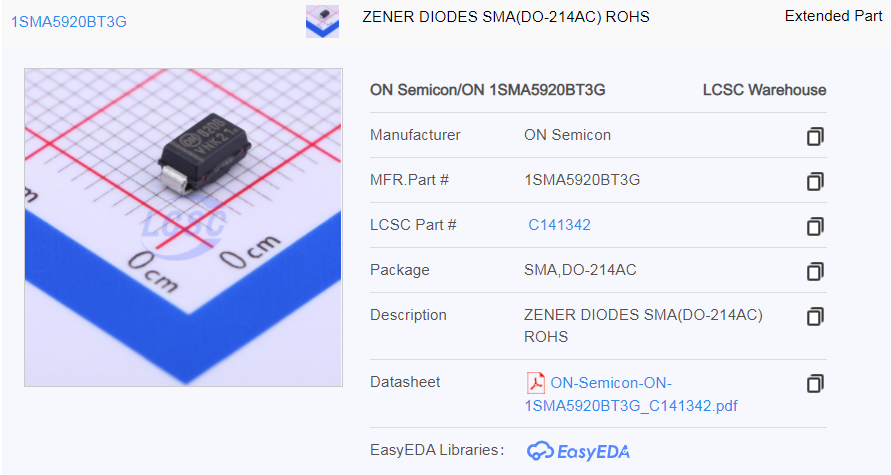
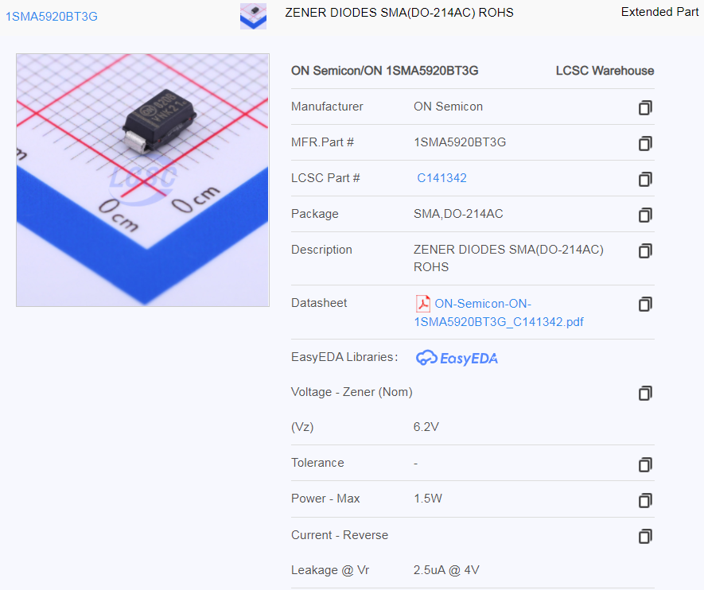
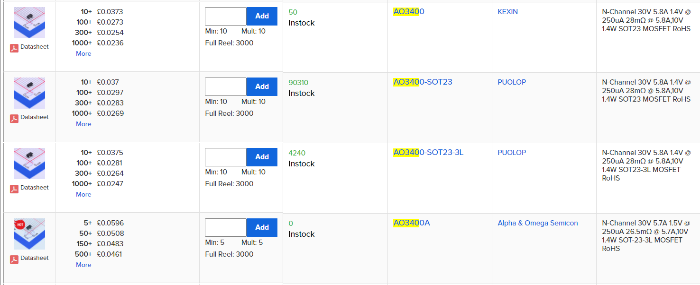
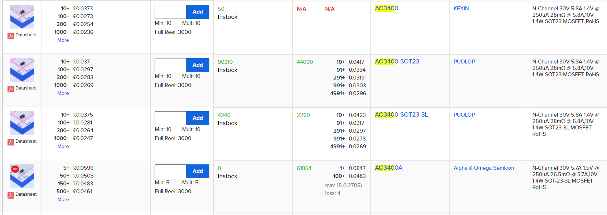

# JLCPCB Tampermonkey Scripts

This repository contains [tampermonkey](https://www.tampermonkey.net/) scripts that integrate data from [LCSC](https://lcsc.com/) and [JLCPCB's parts library](https://jlcpcb.com/parts/) into each other. 

The [JLCPCB Parts List Improvements](jlcpcb-parts-tampermonkey.js) script imports parametric part data from LCSC when you search the JLCPCB parts library. This gives you a bunch more information about how the parts when browsing JLCPCB.

The [JLCPCB stock check for LCSC](lcsc-jlpcb-stock-check.js) script shows JLCPCB stock numbers, pricing, minimum quantity, and loss numbers on LCSC's search results. This helps you quickly see if parts you're looking at are available in LCSC's library.

## How do these scripts improve things?

### JLCPCB Parts List Improvements

Here's a result for a zener diode on JLCPCB's parts page, without the parts list improvements script enabled:

As you can see, it doesn't tell you anything. Not even the zener voltage!

Here's a result with the script enabled:

Much more useful!

### JLCPCB stock check for LCSC

Here's some regular LCSC part results:

Now here's the same results with the script enabled:

Useful!

One thing I plan to add in future is showing stock data on the actual part pages as well as search results.

## Does this work on $browser? How about on Greasemonkey?

I've only tested these scripts on Tampermonkey on Chrome, but they should work with Greasemonkey on other browsers too.

## How do these work?

### JLCPCB Parts List Improvements

LCSC doesn't have an official API, and there's normally no way for scripts on JLCPCB's domain to access data on LCSC's domain due to the same origin security policy. Luckily, Tampermonkey (and Greasemonkey) provide a mechanism to add exceptions to this policy, so this script can make requests to LCSC. The script talks to the same web APIs that LCSC's webpages use to display search results.

When you load a parts search page on JLCPCB, the script makes a request to LCSC in order to extract the [CSRF token](https://en.wikipedia.org/wiki/Cross-site_request_forgery). This is required in order to make API queries. The token is never sent to JLCPCB's server and is kept client-side, so there's no security impact. When you click to expand a part in JLCPCB's database, the script makes a request to LCSC to fetch part details. The part details are then cached until you refresh the page. The cache also persists if you navigate through pages of results. This keeps HTTP requests to a bare minimum.

### JLCPCB stock check for LCSC

JLCPCB's search results and product info are all fetched through ajax requests (XHRs) so it's really easy to just use these APIs. As with the other script, there's normally no way for scripts on LCSC's domain to access data on JLCPCB's domain due to the same origin security policy. Tampermonkey scripts can add an exception to this policy.

Part stock data fetched from JLCPCB is cached persistently in the browser for 24 hours.

## Troubleshooting

At the top of the scripts there's a `debugMode` variable. Set it to true and the script will dump a bunch of output to the console. See [this tampermonkey issue](https://github.com/Tampermonkey/tampermonkey/issues/561) for instructions on how to inpsect the requests being made from the script.

If you run into trouble, open an issue. Can't promise much in terms of support but I'll do my best.

## See also

[Honza Mrázek](https://twitter.com/yaqwsx_cz) made [this really cool parametric search tool for JLCPCB](https://yaqwsx.github.io/jlcparts/). I'm probably just going to use that instead of JLCPCB's website from now on, because it's _so much more useful_.
